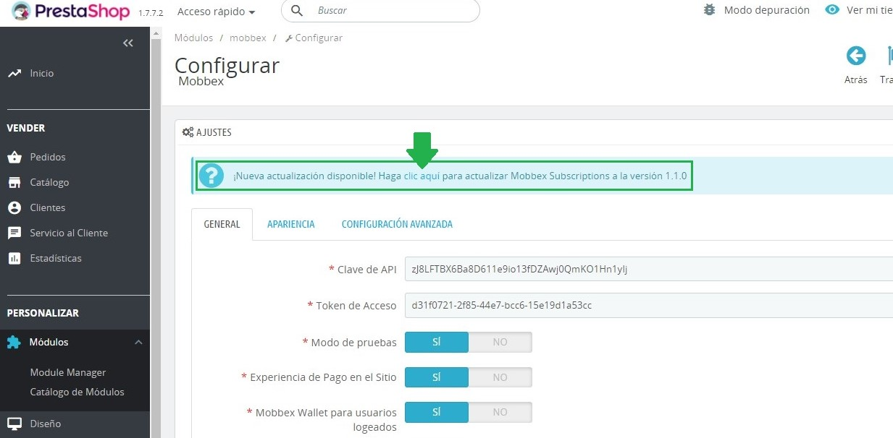

# Mobbex Subscriptions for PrestaShop

## Requisitos
* PHP >= 7.0
* PrestaShop >= 1.6
* Mobbex for PrestaShop >= 2.7.3

## Instalación
> Asegurese de instalar y configurar el [módulo principal de Mobbex](https://github.com/mobbexco/prestashop) antes de comenzar la integración.

1. Descargue la última versión del módulo desde https://github.com/mobbexco/prestashop-subscriptions/releases.
2. Diríjase a la sección "Module Manager" del panel de administración.
3. Presione el botón "Subir un módulo" y seleccione el archivo comprimido.

## Actualización

Cuando exista una actualización, esta se mostrará a modo de alerta en el panel de configuración **del módulo principal**. Para obtener la última versión sólo basta con hacer clic en ella:

## Uso

### Crear suscripción
> Las suscripciones dentro del módulo se crean utilizando productos como base.

1. Diríjase al listado de productos en el panel de administración y presione el botón para añadir uno nuevo:

    

2. Configure el nombre, descripción y precio como con cualquier producto.

3. Diríjase a la pestaña de módulos y dentro del panel de Mobbex active la opción "Modalidad de Suscripción":

    

4. Guarde el producto para que aparezca en la tienda.